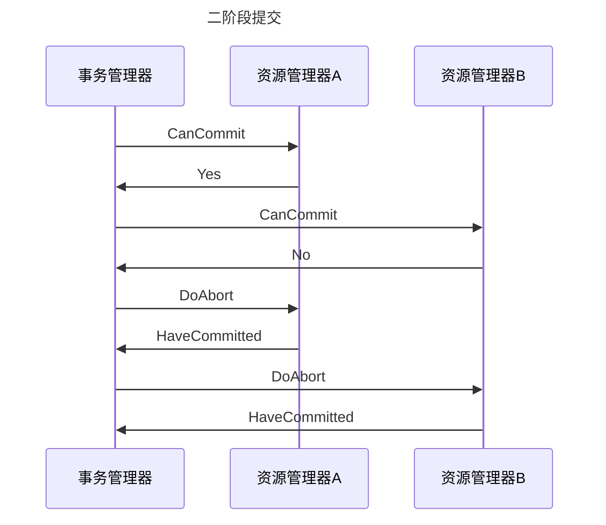
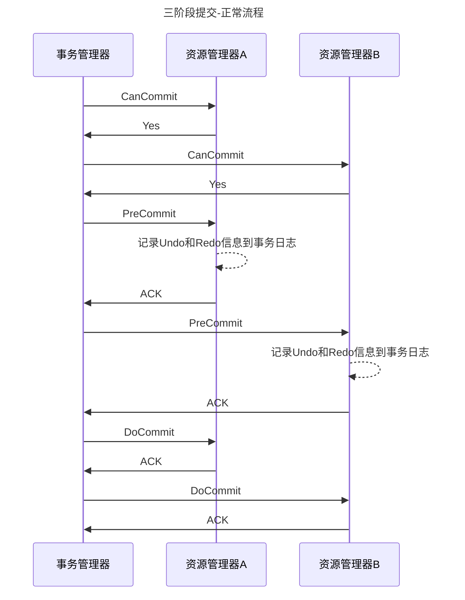

# 理论
## 并发问题来源
并发问题来源于CPU, 内存，IO之间的速度差异，以及为了提升系统速度而做出的努力。
为了平衡

## 实现机制
分为voting, commit两个阶段

## 特性
### 单点故障
事务管理器发生故障

### 数据不一致
DoCommit时发生局部网络故障，接收到的参与者提交请求并执行提交操作，未接到提交请求的参与者则无法执行事务提交。

# 三阶段提交
## 参与者
事务管理器，资源管理器

## 实现机制
分为CanCommit、PreCommit、DoCommit三个阶段

## 特性
### 相比二阶段提交减少单点故障造成的系统阻塞
当参与者在预提交阶段向协调者发送 Ack 消息后，如果长时间没有得到协调者的响应，在默认情况下，参与者会自动将超时的事务进行提交，从而减少整个集群的阻塞时间

### 相比二阶段提交减少数据不一致
DoCommit时发生局部网络故障，参与者会自动将超时的事务进行提交，数据一致

# 基于分布式消息的最终一致性
## 参与者
消息中间件，资源管理器

## 特性
消息中间件会确认各系统的操作结果，若数据一致，则更新消息；若不一致，则回滚操作、删除消息。

