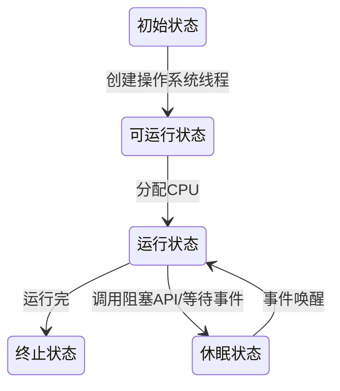
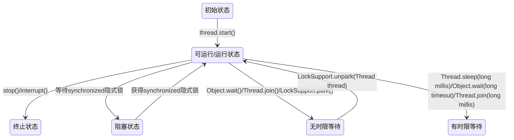

# 理论
## 并发问题来源
并发问题来源于CPU, 内存，IO之间的速度差异，以及为了提升系统速度而做出的努力。
1. 为了弥补CPU与内存的速度差异，引入缓存，这带来了**可见性**问题；
2. 为了弥补CPU与IO设备的速度差异，引入进程，线程，CPU分时复用，这带来了**原子性**问题；
3. 为了合理利用缓存，编译程序优化指令执行，这带来了**有序性**问题。

## 解决可见性和有序性问题——Java内存模型
因为缓存和编译优化带来了可见性和有序性问题，为了解决这两个问题，就需要**部分禁用缓存和编译优化**，这一解决方案统称为**Java内存模型**。
具有的方法包括: **volatile**、**sychronized**、**final**三个关键字，以及六项happens-before规则。
1. 程序的顺序性规则
前面的操作Happens-Before后面的操作
2. volatile变量规则
对一个volatile变量的写操作，Happens-Before于后面的读操作
3. 传递性规则
这条规则是指如果 A Happens-Before B，且 B Happens-Before C，那么 A Happens-Before C。
4. 管程的锁规则
对一个锁的解锁Happens-Before后续对这个锁的加锁。
5. 线程start()规则
主线程启动子线程后，子线程可以看到主线程在启动之前的操作
6. 线程的join()规则
它是指主线程 A 等待子线程 B 完成（主线程 A 通过调用子线程 B 的 join() 方法实现），当子线程 B 完成后（主线程 A 中 join() 方法返回），主线程能够看到子线程的操作。

## 解决原子性问题——互斥锁
互斥锁确保同一时刻只有一个线程执行某一段代码，该段需要互斥执行的代码称为**临界区**。
锁与其保护的资源存在1:N关系。


### Java语言提供的锁 Synchronized
Java 语言提供的 synchronized 关键字，就是锁的一种实现, synchronized 关键字可以用来修饰方法，也可以用来修饰代码块。
Java对象的对象头是synchronized的实现基础。对象头主要结构是由Mark Word 和 Class Metadata Address组成，其中Mark Word存储对象的hashCode、锁信息或分代年龄或GC标志等信息，Class Metadata Address是类型指针指向对象的类元数据，JVM通过该指针确定该对象是哪个类的实例。
锁也分不同状态，JDK6之前只有两个状态：无锁、有锁（重量级锁），而在JDK6之后对synchronized进行了优化，新增了两种状态，总共就是四个状态：无锁状态、偏向锁、轻量级锁、重量级锁，其中无锁就是一种状态了。锁的类型和状态在对象头Mark Word中都有记录，在申请锁、锁升级等过程中JVM都需要读取对象的Mark Word数据。
每一个锁都对应一个monitor对象，在HotSpot虚拟机中它是由ObjectMonitor实现的（C++实现）。每个对象都存在着一个monitor与之关联，对象与其monitor之间的关系有存在多种实现方式，如monitor可以与对象一起创建销毁或当线程试图获取对象锁时自动生成，但当一个monitor被某个线程持有后，它便处于锁定状态。
```C++
ObjectMonitor() {
    _header       = NULL;
    _count        = 0;  //锁计数器
    _waiters      = 0,
    _recursions   = 0;
    _object       = NULL;
    _owner        = NULL;
    _WaitSet      = NULL; //处于wait状态的线程，会被加入到_WaitSet
    _WaitSetLock  = 0 ;
    _Responsible  = NULL ;
    _succ         = NULL ;
    _cxq          = NULL ;
    FreeNext      = NULL ;
    _EntryList    = NULL ; //处于等待锁block状态的线程，会被加入到该列表
    _SpinFreq     = 0 ;
    _SpinClock    = 0 ;
    OwnerIsThread = 0 ;
  }
```
ObjectMonitor中有两个队列\_WaitSet和\_EntryList,用来保存ObjectWaiter对象列表，\_owner持有指向ObjectMonitor对象的线程。
当多个线程访问同步代码时，首先会进入\_EntryList集合，当线程获取到对象的monitor后进入\_Owner区域并把monitor中的\_owner变量设置为当前线程，同时monitor中的计算器\_count加1。
若线程调用wait()方法，将释放当前持有的monitor, \_owner变量恢复为null,  \_count减一, 该线程进入 \_WaitSet集合中等待被唤醒。

|Thread| \_EntryList | \_Owner | \_count | \_WaitSet |
|----------|------|---------|---------|---------------|
|ThreadA|ThreadA|ThreadA|+1||
|wait()||null|-1|ThreadA|
|notifyAll()|||||

### synchronized锁的类型
synchronized依赖于操作系统的Mutex Lock来实现，但操作系统的锁切换线程需要从用户态切换到内核态，成本较高，jdk1.6后引入


## 死锁及其解决方案
### 死锁的形成条件
要形成死锁，必须满足下面的4个条件
1. 互斥
2. 占有且等待
3. 不可抢占
4. 循环等待

破坏其中一个，就可以避免死锁的发生。
* 破坏“占有且等待”，可以一次申请所有资源；
* 破坏”不可抢占“，占用部分资源的线程进一步申请其他资源时，如果申请不到，可以主动释放它占有的资源；
* 破坏"循环等待”，可以按序申请资源。

### 占用且等待的破坏方案
#### 死循环来等待释放锁
#### 等待-通知机制


## 并发编程的问题
### 安全性
本质上就是正确性，就是程序按照我们期望的执行，不要让我们感到意外。
数据竞争，存在共享数据，多个线程读取同一份数据
竞态条件, 程序执行的结果依赖程序执行的顺序
### 活跃性
#### 活锁
#### 解决办法
需要在谦让时，等待一个随机的时间

### 性能
#### 阿姆达尔（Amdahl）定律
#### 解决办法
#### 度量指标
吞吐量: 单位时间内处理的请求数量
延迟: 发出请求到收到响应的时间
并发量： 同时处理的请求数量

## 管程
### 管程
管程，指的是管理共享变量以及对共享变量的操作过程，让它们支持并发。管程支持两类并发领域的经典问题：互斥和并发。
互斥帮助线程避免彼此干扰，并发帮助线程共同完成同一任务。

### MESA模型

#### 组成对象

* 入口等待队列

* 条件变量

* 条件变量的等待队列

* 共享变量的封装类

#### 执行过程

MESA 管程里面，T2 通知完 T1 后，T2 还是会接着执行，T1 并不立即执行，仅仅是从条件变量的等待队列进到入口等待队列里面。

就是需要在一个 while 循环里面调用 wait()。

#### notifyAll()
除非经过深思熟虑，否则尽量使用 notifyAll()。使用 notify() 需要满足以下三个条件：
* 所有等待线程拥有相同的等待条件；
* 所有等待线程被唤醒后，执行相同的操作；
* 只需要唤醒一个线程。

#### 管程使用范例
~~~java

public class BlockedQueue<T>{
  final Lock lock =
    new ReentrantLock();
  // 条件变量：队列不满  
  final Condition notFull =
    lock.newCondition();
  // 条件变量：队列不空  
  final Condition notEmpty =
    lock.newCondition();

  // 入队
  void enq(T x) {
    lock.lock();
    try {
      while (队列已满){
        // 等待队列不满 
        notFull.await();
      }  
      // 省略入队操作...
      //入队后,通知可出队
      notEmpty.signal();
    }finally {
      lock.unlock();
    }
  }
  // 出队
  void deq(){
    lock.lock();
    try {
      while (队列已空){
        // 等待队列不空
        notEmpty.await();
      }
      // 省略出队操作...
      //出队后，通知可入队
      notFull.signal();
    }finally {
      lock.unlock();
    }  
  }
}
~~~

#### 管程的Hasen模型与Hoare模型
Hasen 模型里面，要求 notify() 放在代码的最后，这样 T2 通知完 T1 后，T2 就结束了，然后 T1 再执行，这样就能保证同一时刻只有一个线程执行。
Hoare 模型里面，T2 通知完 T1 后，T2 阻塞，T1 马上执行；等 T1 执行完，再唤醒 T2，也能保证同一时刻只有一个线程执行。但是相比 Hasen 模型，T2 多了一次阻塞唤醒操作。

## 线程
### 通用的线程生命周期


### Java线程生命周期


#### stop() 和 interrupt() 方法的主要区别
1. stop()
杀死线程，并且线程持有的ReentrantLock不会释放
2. interrupt()
* 如果线程处于waiting/timed_waiting状态，会恢复为runable状态，抛出interruptedException;
* 如果线程处于runnable状态
  * 可以通过 isInterrupted() 方法，检测是不是自己被中断了；
  *  阻塞在 java.nio.channels.InterruptibleChannel上，抛出java.nio.channels.ClosedByInterruptException
  *  阻塞在 java.nio.channels.Selector上，java.nio.channels.Selector 会立即返回


### 最佳线程数量
#### CPU 密集型计算场景
理论上“线程的数量 =CPU 核数”就是最合适的。在工程上，线程的数量一般会设置为“CPU 核数 +1”
#### IO密集型计算场景
* 对单核CPU
最佳线程数 =1 +（I/O 耗时 / CPU 耗时）
* 多核 CPU
最佳线程数 =CPU 核数 * [1 +(I/O 耗时 / CPU 耗时)]

### 局部变量线程安全
每个线程都有自己独立的调用栈，局部变量保存在调用栈中
称为**线程封闭**

## 并发策略
1. 封装共享变量
将共享变量作为对象属性封装在内部，对所有公共方法制定并发访问策略
2. 识别共享变量间的约束条件
3. 制定并发访问策略
1) 避免共享
2) 不变模式
3) 管程及其它同步工具

### 原则
1. 优先使用成熟的工具类
2. 迫不得已时才使用低级的同步原语：低级的同步原语主要指的是 synchronized、Lock、Semaphore
3. 避免过早优化，安全第一

# 工具
## lock与condition
### lock方案的特点
lock方案针对Synchronized管程方案的不足，具备如下特点
* 能够响应中断
* 支持超时
* 可以非阻塞的获取锁

### lock确保可见性
顺序性规则：对共享变量的操作，happens-before unlock()操作

## Semaphore
一个计数器，一个等待队列，三个方法

## ReadWriteLock
特点
允许多个线程同时读共享变量
只允许一个线程写共享变量
如果一个线程正在写，禁止读

## StampedLock


## CountDownLatch

## CyclicBarrier

## 并发容器

## 原子类

## Executor

## Future

## CompletableFuture


