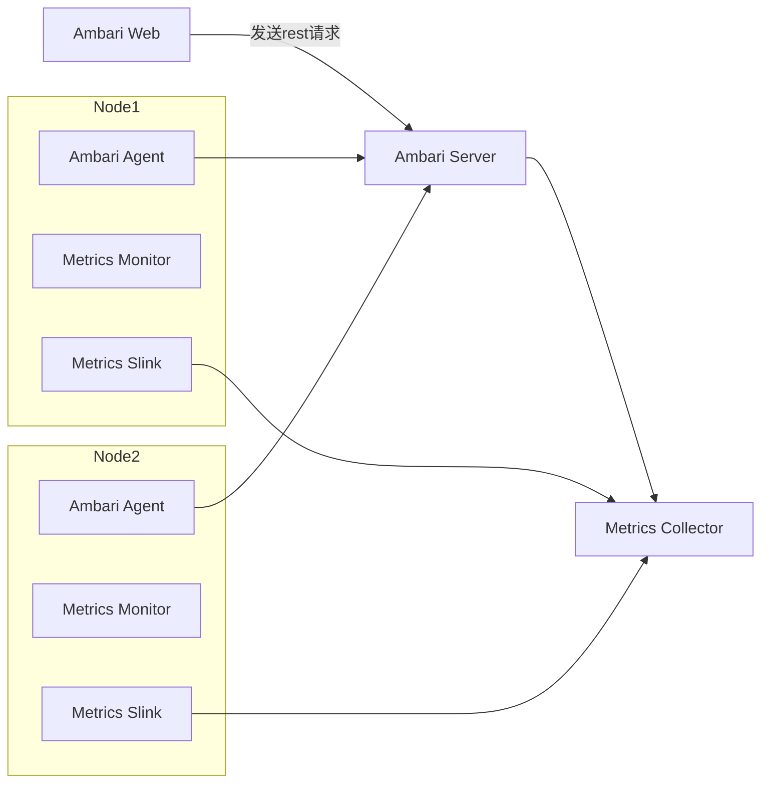

# Ambari的架构和工作原理
## 架构
Ambari由Ambari Server, Ambari Agent, Ambari Web和Metrics Collector组成

```mermaid
graph LR
    web[Ambari Web]--发送rest请求-->server[Ambari Server]-->collector[Metrics Collector]
    subgraph Node1
        agent1[Ambari Agent]
        monitor1[Metrics Monitor]
        slink1[Metrics Slink]
    end
    subgraph Node2
        agent2[Ambari Agent]
        monitor2[Metrics Monitor]
        slink2[Metrics Slink]
    end
    slink1-->collector
    agent1-->server
    slink2-->collector
    agent2-->server


```

