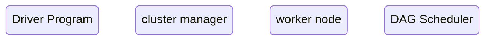

# Spark的原理
## 特点
计算速度快
易于使用
通用大数据框架
支持多种资源管理器
spark生态圈丰富

# Spark架构
## Spark的模块组成

## Spark Core
### 基础设施
#### SparkContext
#### SparkConf
#### Spark RPC
#### ListenerBus
#### MetricsSystem
#### SparkEnv
### 存储系统
### 调度系统

### 计算引擎

## Spark SQL
RDD
### DataFrame
#### 概念
data + schema
可以优化执行计划
#### DataFrame的构建
DataSet

