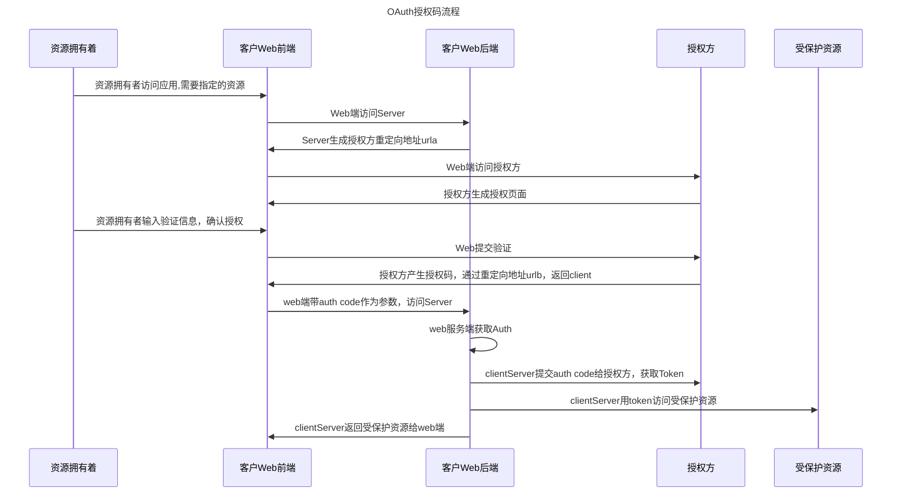

# OAuth2.0的原理
## 参与角色
资源拥有者
受保护资源
授权方
客户端

## 交互流程



```mermaid
sequenceDiagram
Title: OAuth授权码流程
participant resourceOwner as 资源拥有着
participant clientWeb as 客户Web前端
participant clientServer as 客户Web后端
participant AuthorizationServer as 授权方
participant resourceServer as 受保护资源

resourceOwner->>clientWeb: 资源拥有者访问应用,需要指定的资源
clientWeb->>clientServer: Web端访问Server
clientServer->>clientWeb: Server生成授权方重定向地址urla
clientWeb->>AuthorizationServer: Web端访问授权方
AuthorizationServer->>clientWeb: 授权方生成授权页面
resourceOwner->>clientWeb: 资源拥有者输入验证信息，确认授权
clientWeb->>AuthorizationServer: Web提交验证
AuthorizationServer->>clientWeb: 授权方产生授权码，通过重定向地址urlb，返回client
clientWeb->>clientServer: web端带auth code作为参数，访问Server
clientServer->>clientServer: web服务端获取Auth 
clientServer->>AuthorizationServer: clientServer提交auth code给授权方，获取Token
clientServer->>resourceServer: clientServer用token访问受保护资源
clientServer->>clientWeb: clientServer返回受保护资源给web端
```

## 间接通信与直接通信
资源拥有者，client为一方
授权服务器，被保护资源为另一组

client与资源拥有者之间为间接通信，通过浏览器作为中介


```


