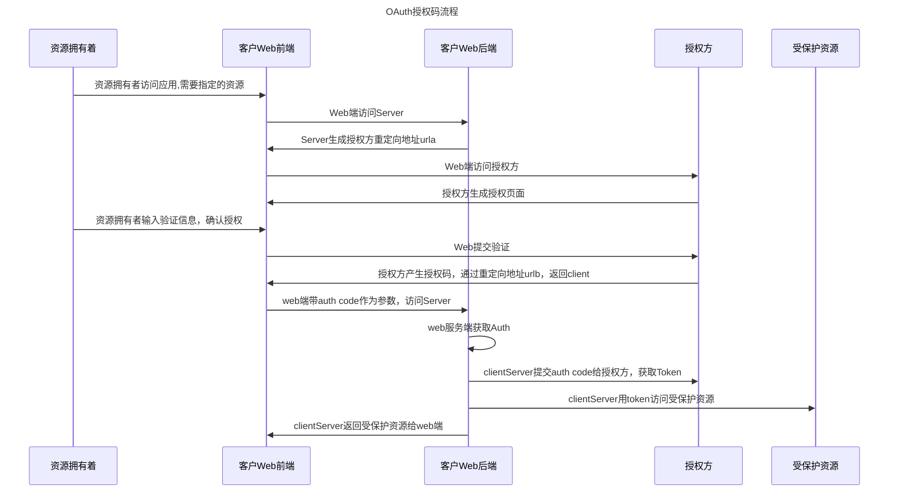
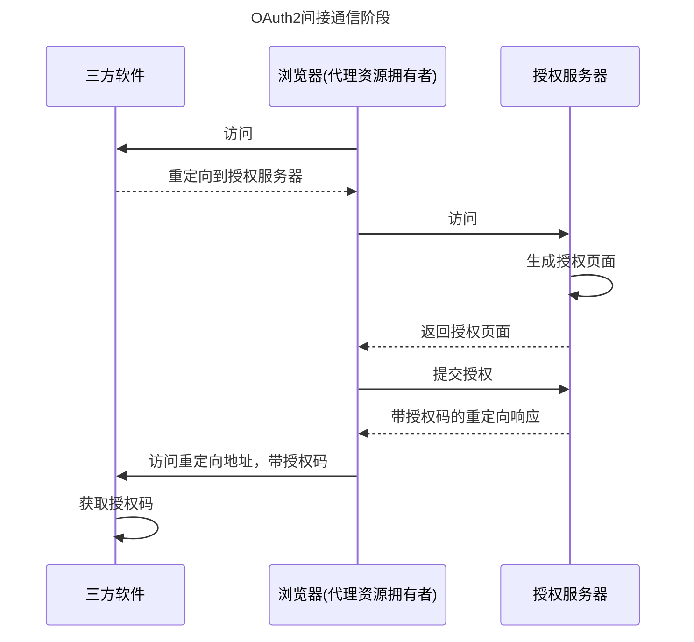
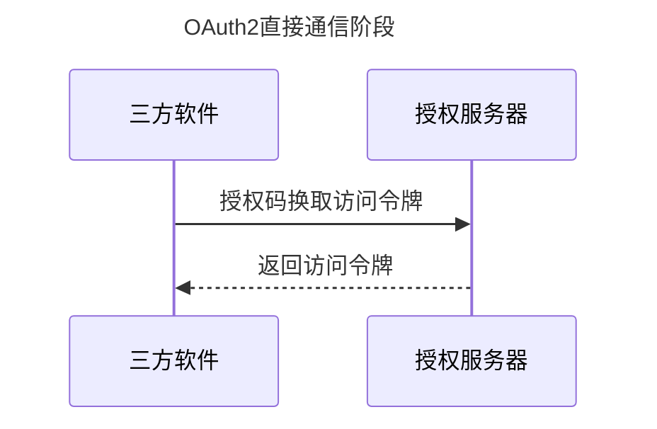
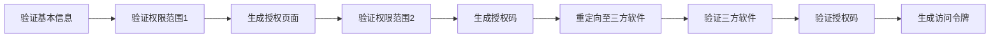

# OAuth2.0的原理
## 参与角色
资源拥有者
受保护资源
授权方
客户端

## 交互流程



## 间接通信与直接通信
资源拥有者，client为一组
授权服务器，被保护资源为另一组

### 间接通信阶段
获取授权码的阶段发生在client与授权服务器之间，该阶段client与授权服务器通过浏览器作为中介进行间接通信。


### 直接通信阶段
授权码换取token令牌阶段为直接通信



## 授权服务工作过程
### 预备阶段——三方软件注册
授权之前有预备阶段，三方软件需要向授权服务器注册，以获取appid，secretKey, 方便通信过程中的校验，同时会申请资源权限范围。

```java
//模拟第三方软件注册之后的数据库存储
Map<String,String> appMap =  new HashMap<String, String>();
appMap.put("app_id","APPID_RABBIT");
appMap.put("app_secret","APPSECRET_RABBIT");
appMap.put("redirect_uri","http://localhost:8080/AppServlet-ch03");
appMap.put("scope","nickname address pic");
```
预备阶段完成后，就是主要的授权阶段，分为以下步骤


### 颁发授权码
#### 第一步——验证基本信息
因为是浏览器端发起，所以需要验证基本信息，比如回调地址与注册时一致
```java
if(!appMap.get("redirect_uri").equals(redirectUri)){
    //回调地址不存在
}
```
#### 第二步——验证权限范围
对三方软件传过来的 scope 参数与注册时申请的权限范围做比对。如果请求过来的权限范围大于注册时的范围，就需要作出越权提示。此刻是第一次权限校验。
```java
String scope = request.getParameter("scope");
if(!checkScope(scope)){
    //超出注册的权限范围
}
```
#### 第三步——生成授权页面
这个授权请求页面就是授权服务上的页面，资源拥有者可以选择缩小这个权限范围

#### 第四步——验证权限范围
对资源拥有者授权的权限与三方软件注册的权限做校验，如果超出，则抛出异常

#### 第五步——生成授权码
授权服务会校验响应类型 response_type 的值。如果response_type为 code （ type有code和token 两种值）, 则生成auth code。同时将生成的授权码 code 值与 app_id、user 进行关系映射
```java
String code = generateCode(appId,"USERTEST");//模拟登录用户为USERTEST
private String generateCode(String appId,String user) {
  String code = strb.toString();
  codeMap.put(code,appId+"|"+user+"|"+System.currentTimeMillis());
  return code;
}
```
注意：
* 一个授权码 code 只能被使用一次。
* 授权码 code 需要和已经授权的权限范围 rscope 进行绑定并存储。
目的是为了颁发访问令牌时，能够通过 code 值取出授权范围并与访问令牌绑定。

#### 第六步——重定向至第三方软件
颁发授权码 code 的流程全部完成。三方软件取到授权码 code 值后就可以用来换取访问令牌。

### 颁发访问令牌
#### 第七步——验证第三方软件是否存在
验证第三方软件是否存在
```java
if(!appMap.get("app_id").equals(appId)){
    //app_id不存在
}
if(!appMap.get("app_secret").equals(appSecret)){
    //app_secret不合法
}
```
#### 第八步——验证授权码 code 值是否合法
确认过授权码 code 值有效以后，应该立刻从存储中删除当前的 code 值。
```java
String code = request.getParameter("code");
if(!isExistCode(code)){//code值不存在
  return;
}
codeMap.remove(code);//授权码一旦被使用，须立即作废
```
#### 第九步——生成访问令牌access_token
access_token具备唯一性、不连续性、不可猜性。
需要把 access_token 存储起来，并将其与第三方软件的应用标识 app_id 和资源拥有者标识 user 进行关系映射。
access_token与授权范围做绑定。
```java
Map<String,String[]> tokenScopeMap =  new HashMap<String, String[]>();
//生成访问令牌access_token的值
String accessToken = generateAccessToken(appId,"USERTEST");
//授权范围与访问令牌绑定
tokenScopeMap.put(accessToken,codeScopeMap.get(code));

//生成访问令牌的方法
private String generateAccessToken(String appId,String user){
  String accessToken = UUID.randomUUID().toString();
  String expires_in = "1";//1天时间过期
  tokenMap.put(accessToken,appId+"|"+user+"|"+System.currentTimeMillis()+"|"+expires_in);
  return accessToken;
}
```

## 刷新令牌
刷新令牌用于在访问令牌失效的情况下，为了不让用户频繁手动授权，用来通过系统重新请求生成一个新的访问令牌。生成访问access_token时，可以同时生成refresh_token。
颁发刷新令牌的逻辑与access_token一样
```java
Map<String,String> refreshTokenMap =  new HashMap<String, String>();
//生成刷新令牌refresh_token的值
String refreshToken = generateRefreshToken(appId,"USERTEST");
private String generateRefreshToken(String appId,String user){
  String refreshToken = UUID.randomUUID().toString();
  refreshTokenMap.put(refreshToken,appId+"|"+user+"|"+System.currentTimeMillis());
  return refreshToken;
} 
```
### 使用刷新令牌
#### 验证刷新令牌
验证第三方软件是否存在，验证刷新令牌是否存在，验证刷新令牌是否属于该第三方软件
#### 重新生成访问令牌

## JWT令牌
### JWT令牌的价值
#### 令牌内检
受保护资源调用授权服务提供的令牌校验服务，成为令牌内检。
令牌内检需要花费计算资源，而使用JWT可以避免这些花销。
第一，JWT 的核心思想，就是用计算代替存储，有些 “时间换空间” 的 “味道”
第二，也是一个重要特性，是加密
第三，使用 JWT 格式的令牌，有助于增强系统的可用性和可伸缩性

### JWT令牌的格式
JWT包含Header, Payload, Signature三部分
#### Header
表示装载令牌类型和算法等信息，是 JWT 的头部。其中，type 表示第二部分 PAYLOAD 是 JWT 类型，alg 表示使用 HS256 对称签名的算法。
#### Payload
Payload 部分也是一个 JSON 对象，用来存放实际需要传递的数据。JWT 规定了7个官方字段，供选用。
iss (issuer)：签发人
exp (expiration time)：过期时间
sub (subject)：令牌的主体，一般设为资源拥有者的唯一标识
aud (audience)：受众
nbf (Not Before)：生效时间
iat (Issued At)：签发时间
jti (JWT ID)：编号

除了官方字段，你还可以在这个部分定义私有字段，下面就是一个例子。
{ “sub”: “1234567890”, “name”: “John Doe”, “admin”: true}
注意，JWT 默认是不加密的，任何人都可以读到，所以不要把秘密信息放在这个部分。

#### Signature
对前两部分的签名，防止数据篡改。
首先，需要指定一个密钥（secret）。这个密钥只有服务器才知道，不能泄露给用户。然后，使用 Header 里面指定的签名算法（默认是 HMAC SHA256），按照下面的公式产生签名。
HMACSHA256( base64UrlEncode(header) + “.” + base64UrlEncode(payload), secret)

>**Base64URL**
>这个算法跟 Base64 算法基本类似，但有一些小的不同。
>Base64 有三个字符 +、/ 和 = ，在 URL 里面有特殊含义，所以要被替换掉： = 被省略、 + 替换成 - ， / 替换成 _ 。这就是 Base64URL 算法。
>因为JWT 作为一个令牌（token），有些场合可能会放到 URL（比如 api.example.com/?token=xxx）。

算出签名以后，把 Header、Payload、Signature 三个部分拼成一个字符串，每个部分之间用"点"（ . ）分隔，就可以返回给用户。


### JWT令牌的缺点
#### 没办法在使用过程中修改令牌状态
解决的办法通常有两种
* 将每次生成 JWT 令牌时的秘钥粒度缩小到用户级别，也就是一个用户一个秘钥。这样，当用户取消授权或者修改密码后，就可以让这个密钥一起修改。一般情况下，这种方案需要配套一个单独的密钥管理服务。
* 在不提供用户主动取消授权的环境里面，如果只考虑到修改密码的情况，那么我们就可以把用户密码作为 JWT 的密钥。当然，这也是用户粒度级别的。这样一来，用户修改密码也就相当于修改了密钥。
但这样资源提供方验证JWT时就需要调用外部服务来获取当时的密钥，增加了计算量

#### 安全性问题
JWT 本身包含了认证信息，一旦泄露，任何人都可以获得该令牌的所有权限。为了减少盗用，JWT 的有效期应该设置得比较短。对于一些比较重要的权限，使用时应该再次对用户进行认证。
为了减少盗用，JWT 不应该使用 HTTP 协议明码传输，要使用 HTTPS 协议传输。

### JWT令牌的生命周期
JWT令牌有三种失效方式
令牌自然过期
访问令牌失效后，用刷新令牌来获取新的访问令牌
主动请求令牌过期

### JJWT开源工具
使用示例

```Java
String sharedTokenSecret="hellooauthhellooauthhellooauthhellooauth";//密钥
Key key = new SecretKeySpec(sharedTokenSecret.getBytes(),
                SignatureAlgorithm.HS256.getJcaName());

//生成JWT令牌
String jwts=
Jwts.builder().setHeaderParams(headerMap).setClaims(payloadMap).signWith(key,SignatureAlgorithm.HS256).compact()

//解析JWT令牌
Jws<Claims> claimsJws =Jwts.parserBuilder().setSigningKey(key).build().parseClaimsJws(jwts);
JwsHeader header = claimsJws.getHeader();
Claims body = claimsJws.getBody();  
```

# 接入OAuth 2.0
## 第三方软件
第三方软件要接入OAuth2.0， 需要实现4个部分的逻辑
### 注册三方软件信息
为了使用OAuth2.0, 必须在授权平台进行登记，同时还要填写自己的回调地址 redirect_uri、申请权限等信息，获取到平台分配的 app_id 和 app_serect 等信息。

### 引导授权
当用户需要使用第三方软件，来操作其在受保护资源上的数据，就需要第三方软件来引导授权。

### 使用访问令牌

### 使用刷新令牌
定时检查access_token的expires_in, 发现访问令牌过期，就用刷新令牌取换取访问令牌

## 受保护资源
### 检查令牌的合法性
### 校验权限范围
#### 1. 不同的权限对应不同的操作
#### 2. 不同的权限对应不同的数据
#### 3. 不同的用户对应不同的数据

### 网关的统一处理
微服务组成的系统中，如果每个服务都独立进行令牌和权限校验，会造成逻辑的重复。这时可以在API网关进行统一的校验.


